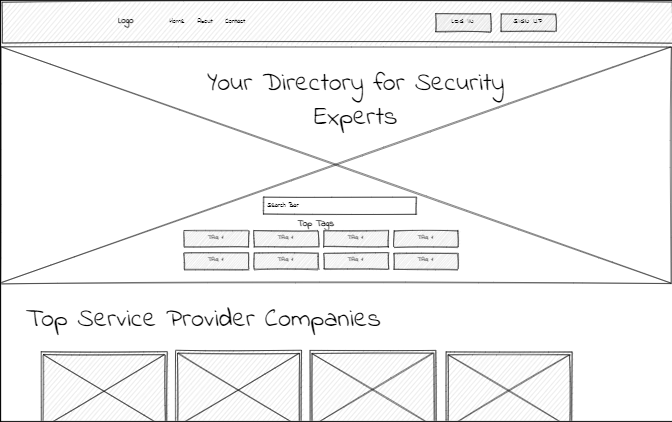
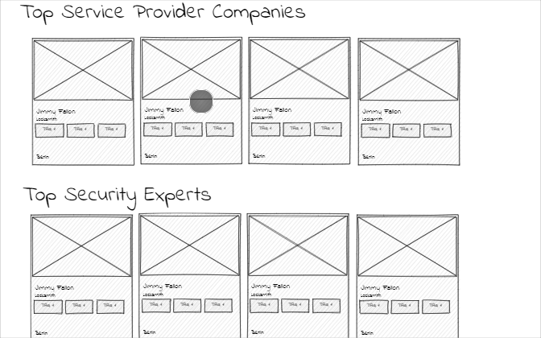

<div style="text-align:center"><a href="https://github.com/alexanderpuschkinberlin/universal-directory"></a></div>

<h1>Universal Directory</h1>

<h2>Table of Content</h2>

- [Project Link](#project-link)
- [Getting Started](#getting-started)
- [Contributors](#contributors)
- [About The project](#about-the-project)

  - [User Flow](#user-flows)
  - [Technologies Used](#technologies-used)
  - [Web APIs](#web-apis)
  - [Wireframes](#wireframes)

- [Plans For Improvement](#plansforimprovement)
- [Screenshots](#Screenshots)

  - [Index page](#index-page)
  - [Analyse page Flights](#analyse-page-flights)
  - [Analyse page Vehicles](#analyse-page-vehicles)
  - [Plan page](#plan-page)
  - [Plan with recent search](#plan-with-recent-search)
  - [Local Storage](#local-storage)

### Project Link

- Please click [here](https://github.com/alexanderpuschkinberlin/universal-directory) to see the contents of our project in Github
- [here](https://obscure-thicket-70245.herokuapp.com/) you can see the deployed app on heroku
- Please click [here](https://docs.google.com/presentation/d/1oE0r5BqziUkpUkxwTSKMjsCLHVNPoBZU8sNTUb8xkL8/edit) to see the presentation of the project

### Getting Started

```
git clone
cd universal-directory
code .
seed the data
  run mysql2
  run the table in db
  quit
npm run seed
npm run dev
open the url by ctrl+click


```

### Contributors

- Zahra : https://github.com/Amir-Fard2025
- Alexander : https://github.com/alexanderpuschkinberlin
- Amir : https://github.com/Amir-Fard2025

### About The Project

<p>this project is a complete presentation of the usage of MVC in web development. using the model and seed the data with sequelize, and different controllers to conect the model to view and update the changes. The views are presented with handlebars</p>

#### User Flow

<p>the professionals who are using this app, they have this ability ti update their profile and to be order by clients. The workers can sign up and do edits, and normal users can search for different professionals</p>

#### Technologies Used

<p>The following technologies are implemented in this project:</p>

- HTML
- CSS
- Tailwindcss
- JavaScript
- jQuery
- Express
- Mysql2
- Sequelize
- Node
- Handlebars

#### Web APIs

- The following APIs are implemented in this project:
- [](google maps)
- []()

#### Wireframes

> Note:
> The structure of the code has been built According to the main flowcharts; however there could be some slight changes during the developing process




#### Plans For Improvement

<p>The following mission are our next steps: </p>

- Many2Many relation
- Design improvement for profile page
- Add rating and comments section for clients
- Add online payment support
